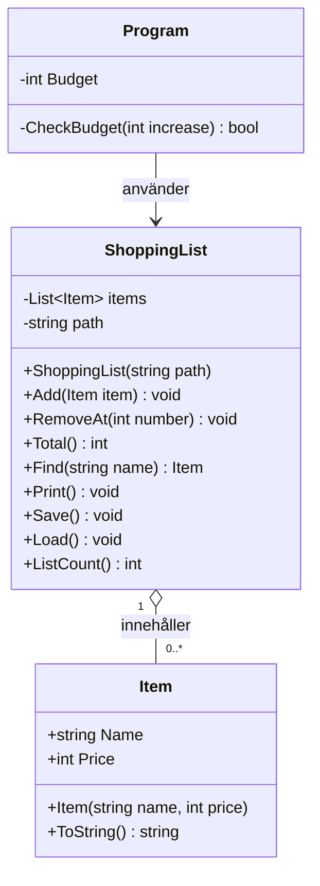

### BudgettTak

Gjorde budgettaket genom att skapa en funktion i Program.cs som kollar om priset man lägget till i totalsumman överstiger budgeten eller inte. Om den inte överstiget budgeten läggs den till i inköpslistan och om den överstiger säger programet att varan skuller öka totalsumman över budgeten och lägger inte till den i inköpslistan.

Anledningen till varför jag använde mig av en funktion istället för en try catch är för att jag inte har mycket erfarenhet med try catch methoden och kunde enkelt använda en funktion för att lösa problemet.

### Felrapport

### Klassdiagram

- `+` betyder public och `-` betyder private.
- `Program` använder en `ShoppingList`, som innehåller noll eller flera `Item`.

