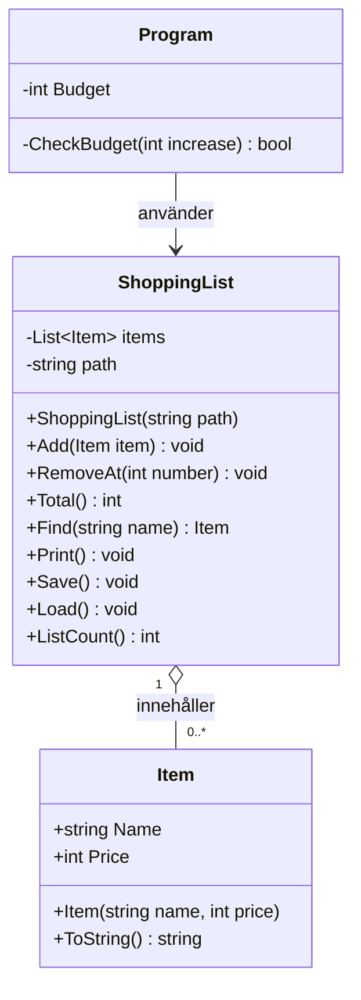

### BudgettTak

Gjorde budgettaket genom att skapa en funktion i Program.cs som kollar om priset man lägget till i totalsumman överstiger budgeten eller inte. Om den inte överstiget budgeten läggs den till i inköpslistan och om den överstiger säger programet att varan skuller öka totalsumman över budgeten och lägger inte till den i inköpslistan.

Anledningen till varför jag använde mig av en funktion istället för en try catch är för att jag inte har mycket erfarenhet med try catch methoden och kunde enkelt använda en funktion för att lösa problemet.

### Felrapport

1. Items.txt
    * Hadde en tom linje vilket krashade programmet vid load:ens text.Split('\n') vilket gjorde att part[1] inte hadde något att ärva och krashade.
    * Blev fixat med en if(line.Trim() == ") continue; vilket skippar tomma linjer.

2. ShoppingList.Load()
    * ShoppingList.Load() splitade linjer på '\n' men laddade in en fil som använde '\r\n' vilket lämnade '\r' som skapade "gömda" linje splitare som gjorde writeline() mindre läsbart och lästes in på save() funktionen och skapade flera tomma linjer i filen.
    * Blev fixat genom att byta ut File.WriteAllText till en File.WriteAllLines vilket inte behöver antingen '\r\n' eller en text.Split('\n') och med in part[1].Trim() vilket tog bort några '\r' som kan ha lämnats kvar utav förgående kod.

3. ShoppingList.Total()
    * ShoppingList.Total() for loopen började med int i = 1 vilket skippade den första produkten i listan.
    * Blev fixat med att byta ut 1 med 0.

4. int.parce
    * Program.cs använde flera int.parce viket hadde kunnat krashat programmet om man gav fel typ t.ex en string när den frågar efter ett nummer.
    * Blev fixat genom att göra om dem till en while loop med en int.tryparce med en consonle.readline i dem.

5. ShoppingList.RemoveAt()
    * Använde också int.parce men denna krashade även med en int.trypace om man skrev ett nummer som inte fanns. T.ex 0 eller 6 om listan var 5 lång.
    * Fixade det genom att lägga till en minimum på 1 och ett maximum beroende på listans längd på inmatningen.

6. ShoppingList.Save()
    * Hadde en tom catch som inte hade skivit ut ett fel om något hade gåt fel.
    * Fixade genom att ta bort den efter som den blev onödig efter jag hade fixat med input felhantering på namnet på produktvaran så den inte kan ha ett tomt namn eller innehålla ett ';'.

7. Krash om items.txt inte finns
    * Programmet krashade om filen inte fanns pga Shoppinglist.load använder sig av filen för att ladda alla sparade varor i text filen.
    * Skapade en if i början utav Program.cs som kollar om filen existerar och om den inte gör det skapar den en tom items.txt fil.

8. Inmatning utav ';' i namn
    * Om man matade in ett namn på en vara med ett namn som innehåller ';' hade ; och det efter den blevit helt ignoerat utav programmet men fortfarande blevit sparad in i items.txt men hade inte krashat programmet.
    * La till en while loop som kollade om namnet på varan innehåller ';' och om namnet gör det behöver man göra en ny inmatning tills namnet inte innehåller tecknet ';'.

### Klassdiagram

- `+` betyder public och `-` betyder private.
- `Program` använder en `ShoppingList`, som innehåller noll eller flera `Item`.

